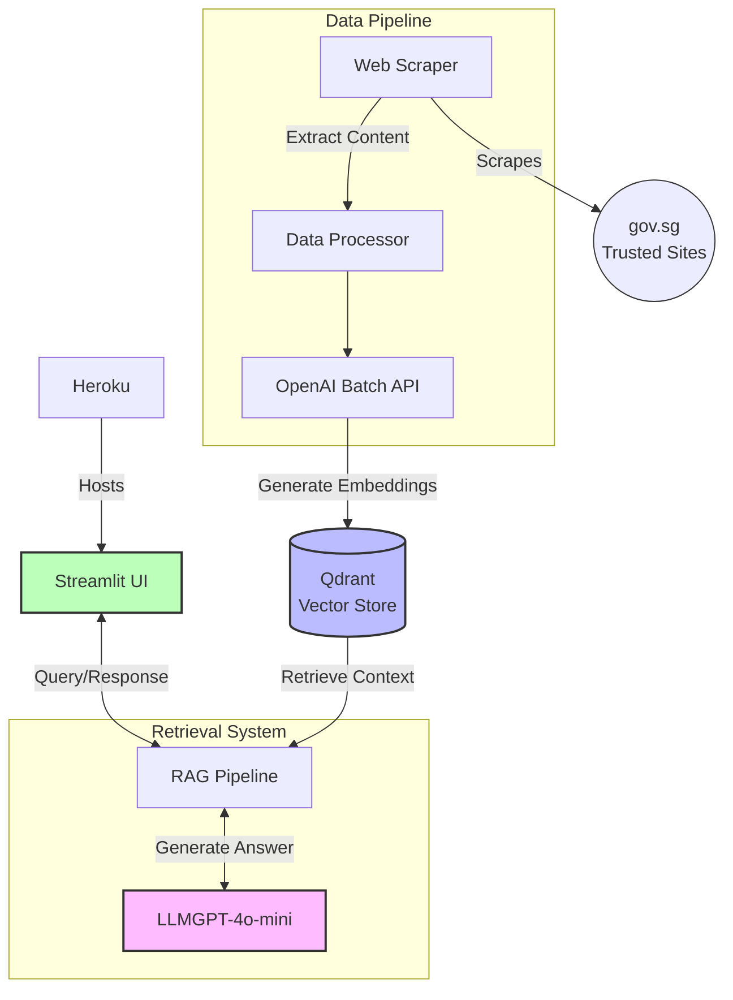

<a id="readme-top"></a>
<!-- PROJECT SHIELDS -->
[![Contributors][contributors-shield]][contributors-url]
[![Forks][forks-shield]][forks-url]
[![Stargazers][stars-shield]][stars-url]
[![Issues][issues-shield]][issues-url]
[![LinkedIn][linkedin-shield]][linkedin-url]

<!-- PROJECT LOGO -->
<br />
<div align="center">
  <a href="https://github.com/shafiqninaba/gov-seek">
    
  </a>
<h3 align="center">GovSeek</h3>

  <p align="center">
    Proof-of-concept for a RAG-based chatbot for government services
    <br />
    <a href="https://gov-seek-e2a21ca71a09.herokuapp.com/">View Demo</a> (message me on <a href="https://linkedin.com/in/shafiq-ninaba">LinkedIn</a> for login password)
    <br>
    <a href="https://github.com/shafiqninaba/gov-seek/issues/new?labels=bug&template=bug-report---.md">Report Bug</a>
    &middot;
    <a href="https://github.com/shafiqninaba/gov-seek/issues/new?labels=enhancement&template=feature-request---.md">Request Feature</a>
  </p>
</div>

<!-- TABLE OF CONTENTS -->
<details>
  <summary>Table of Contents</summary>
  <ol>
    <li>
      <a href="#about-the-project">About The Project</a>
      <ul>
        <li><a href="#built-with">Built With</a></li>
      </ul>
    </li>
    <li>
      <a href="#getting-started">Getting Started</a>
      <ul>
        <li><a href="#prerequisites">Prerequisites</a></li>
        <li><a href="#installation">Installation</a></li>
      </ul>
    </li>
    <li><a href="#usage">Usage</a></li>
    <li><a href="#roadmap">Roadmap</a></li>
    <li><a href="#contributing">Contributing</a></li>
    <li><a href="#license">License</a></li>
    <li><a href="#contact">Contact</a></li>
    <li><a href="#acknowledgments">Acknowledgments</a></li>
  </ol>
</details>

### Built With

* [![Python][Python-img]][Python-url]
* [![uv][uv-img]][uv-url]
* [![LangChain][LangChain-img]][LangChain-url]
* [![OpenAI][openai-img]][openai-url]
* <a href="https://qdrant.tech/"></a>


<p align="right">(<a href="#readme-top">back to top</a>)</p>

<!-- ABOUT THE PROJECT -->
## About The Project

[![Product Name Screen Shot][product-screenshot]](https://gov-seek-e2a21ca71a09.herokuapp.com/)

This is a personal project to demonstrate the use of Retrieval-Augmented Generation (RAG) for a chatbot that helps users find more information about anything found in https://www.gov.sg/trusted-sites. The chatbot is built using LangChain, OpenAI's GPT-4o-mini for the chat model and Qdrant for the vector store. The chatbot is hosted on Heroku and can be accessed [here](https://gov-seek-e2a21ca71a09.herokuapp.com/). The chatbot is password-protected, so please message me on [LinkedIn](https://linkedin.com/in/shafiq-ninaba) for the password.

### Description



GovSeek's backend mainly consists of two parts:
- Data Pipeline
- Retrieval and question answering Pipeline

#### Data Pipeline
This portion recursively scrapes, processes, and retrieves information from a starting URL (in this case, the list of [trusted sites from gov.sg](https://www.gov.sg/trusted-sites)).

1. Web Scraping

The [`scrape_websites.py`](src/scrape_websites.py) and [`crawler.py`](src/data_pipeline/crawler.py) script is responsible for scraping content from trusted government websites. It uses the `BaseScraper` and `WebScraper` classes to fetch and parse webpage content, extract links, and save the cleaned text content to `.json` files.

2. Data Processing

The [`batch_embeddings.py`](src/data_pipeline/batch_embeddings.py) scripts process the scraped data by batching and uploading it to the [OpenAI's Batch API](https://platform.openai.com/docs/guides/batch) (to save cost) to generate embeddings. The embeddings are then saved as `.jsonl` files.

3. Combining Data and Embeddings

The [`combine_embeddings.py`](src/data_pipeline/combine_embeddings.py) script combines the input data and the generated embeddings into a single file to be used to populate the Qdrant vector store. This contains the `id`, `link`, `text`, and `embedding` fields.

#### Retrieval and Question Answering Pipeline

4. Populating the Vector Store

The [vector_store.py](src/data_pipeline/vector_store.py) script populates the Qdrant vector store with the data and embeddings. The vector store is used to perform similarity searches for retrieving relevant information during the chatbot's retrieval pipeline.

5. Retrieval Pipeline

The [`retriever.py`](src/retrieval_pipeline/retriever.py) script implements the retrieval pipeline. It uses `LangGraph` to build a state graph that retrieves information related to a query, generates a response using the retrieved content, and keeps track of the chat's history.

6. Streamlit Application

The [`streamlit_app.py`](src/streamlit_app.py) script provides a user interface for the GovSeek chatbot. Users can ask questions, and the chatbot retrieves relevant information from the vector store and generates responses.

7. Deployment

The Streamlit application is deployed on Heroku with Docker. The vector store is hosted on Qdrant's cloud service.

<p align="right">(<a href="#readme-top">back to top</a>)</p>

<!-- GETTING STARTED -->
## Getting Started

To get a local copy up and running follow these simple steps.

### Prerequisites

- [`uv`](https://docs.astral.sh/uv/) package manager
- [OpenAI API](https://platform.openai.com/) Key
- [Qdrant API](https://qdrant.tech/) Key

### Installation

1. Clone the repo
   ```sh
   git clone https://github.com/shafiqninaba/gov-seek.git
   ```
2. Install dependencies
   ```sh
   uv sync
   ```
3. Enter your API credentials in `.env`
   ```
   OPENAI_API_KEY = <your-openai-api-key>
   QDRANT_URL = <your-qdrant-url>
   QDRANT_API_KEY = <your-qdrant-api-key>
   ```
4. Change git remote url to avoid accidental pushes to base project
   ```sh
   git remote set-url origin shafiqninaba/gov-seek
   git remote -v # confirm the changes
   ```

<p align="right">(<a href="#readme-top">back to top</a>)</p>


<!-- USAGE EXAMPLES -->
## Usage

Use this space to show useful examples of how a project can be used. Additional screenshots, code examples and demos work well in this space. You may also link to more resources.

<p align="right">(<a href="#readme-top">back to top</a>)</p>

<!-- CONTACT -->
## Contact

<a href="https://github.com/shafiqninaba/gov-seek/graphs/contributors">
  
</a>

Shafiq Ninaba | shafiqninaba@gmail.com | [LinkedIn](https://linkedin.com/in/shafiq-ninaba)

<p align="right">(<a href="#readme-top">back to top</a>)</p>

<!-- MARKDOWN LINKS & IMAGES -->
<!-- https://www.markdownguide.org/basic-syntax/#reference-style-links -->
[contributors-shield]: https://img.shields.io/github/contributors/shafiqninaba/gov-seek.svg?style=for-the-badge
[contributors-url]: https://github.com/shafiqninaba/gov-seek/graphs/contributors
[forks-shield]: https://img.shields.io/github/forks/shafiqninaba/gov-seek.svg?style=for-the-badge
[forks-url]: https://github.com/shafiqninaba/gov-seek/network/members
[stars-shield]: https://img.shields.io/github/stars/shafiqninaba/gov-seek.svg?style=for-the-badge
[stars-url]: https://github.com/shafiqninaba/gov-seek/stargazers
[issues-shield]: https://img.shields.io/github/issues/shafiqninaba/gov-seek.svg?style=for-the-badge
[issues-url]: https://github.com/shafiqninaba/gov-seek/issues
[linkedin-shield]: https://img.shields.io/badge/-LinkedIn-black.svg?style=for-the-badge&logo=linkedin&colorB=555
[linkedin-url]: https://linkedin.com/in/shafiq-ninaba
[product-screenshot]: images/screenshot.png
[LangChain-img]: https://img.shields.io/badge/LangChain-ffffff?logo=langchain&logoColor=green
[LangChain-url]: https://www.langchain.com/
[Python-img]: https://img.shields.io/badge/python-3670A0?style=for-the-badge&logo=python&logoColor=ffdd54
[Python-url]: https://www.python.org/
[uv-img]: https://img.shields.io/badge/uv-package%20manager-blueviolet
[uv-url]: https://docs.astral.sh/uv/
[openai-img]: https://shields.io/badge/-OpenAI-93f6ef?logo=openai
[openai-url]: https://platform.openai.com/
